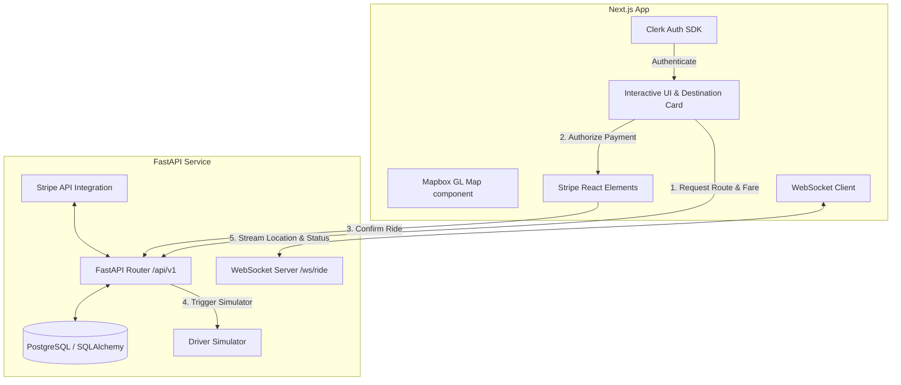

# 📍 RouteWise

RouteWise is a modern, high-performance ride-hailing simulation application. Built with a robust asynchronous backend using **FastAPI** and an interactive, real-time frontend using **Next.js** and **Mapbox**, RouteWise implements the complete lifecycle of a ride-sharing service: user roles, geocoding and routing, payment pre-authorization, real-time driver tracking, and trip status updates.

It features secure authentication powered by **Clerk**, database management through **PostgreSQL & SQLAlchemy**, payment integration via **Stripe**, and real-time streaming with **WebSockets**.

---

## 🚀 Key Features

*   👥 **User & Auth Management**: Dual-role support (Riders and Drivers) with Clerk authentication, customized login/signup interfaces, and secure page-level redirects.
*   🗺️ **Interactive Mapping & Routing**: Real-time map rendering using Next.js and Mapbox GL with dynamic markers for pickup, dropoff, and live vehicle location tracking.
*   💳 **Pre-Authorized Payments**: Integrated Stripe Elements payment flows. Authorize the fare when requesting a ride, and capture it only upon successful completion.
*   📡 **Real-Time WebSockets**: Bidirectional updates streaming driver positions and trip phases from the backend.
*   🚗 **Driver Simulation & OTP**: Simulates driver routing en route to the pickup location and the trip to the destination. Security-verified trip starts via OTP.
*   🗄️ **Async Database Engine**: Fully asynchronous database interactions using PostgreSQL, SQLAlchemy Async ORM, and Alembic migrations.

---

## 🛠️ Architecture Overview

The project is structured as a monorepo containing two decoupled systems:



---

## 📁 Repository Structure

```
RouteWise/
├── backend/
│   ├── app/
│   │   ├── api/            # API endpoints (health, users, rides, navigation, WebSockets)
│   │   ├── core/           # Configuration, logging, and settings
│   │   ├── db/             # SQLAlchemy connection & session management
│   │   ├── models/         # SQLAlchemy ORM models (User, Ride)
│   │   ├── schemas/        # Pydantic schemas for data validation
│   │   └── services/       # Business logic (simulators, external clients)
│   ├── alembic/            # Database migration scripts
│   ├── tests/              # Pytest test suite
│   ├── pyproject.toml      # Project configuration & package metadata
│   ├── requirements.txt    # Python dependencies
│   ├── runtime.txt         # Pinned python runtime for Render deployment
│   └── seed_user.py        # Database seed script for mock rider user
└── frontend/
    ├── app/                # Next.js app router pages & styles
    ├── components/         # Reusable React components (Map, DestinationCard, StripeForm)
    ├── context/            # React context providers (e.g. Socket context)
    ├── lib/                # API helpers and client hooks
    ├── types/              # TypeScript declarations
    ├── package.json        # Node.js dependencies
    └── .npmrc              # NPM configuration to bypass peer conflicts
```

---

## 🚀 Getting Started

### Prerequisites
*   Python 3.10+ (Recommended: `3.11.4` or `3.12.x`)
*   Node.js 18+
*   PostgreSQL database (e.g., Supabase or Neon)
*   Mapbox Access Token (free tier)
*   Clerk Project API Keys (test mode)
*   Stripe API Keys (test mode)

---

### 1. Backend Setup

1.  Navigate to the backend directory:
    ```bash
    cd backend
    ```
2.  Create and activate a virtual environment:
    ```bash
    python -m venv venv312
    # Windows:
    .\venv312\Scripts\activate
    # macOS/Linux:
    source venv312/bin/activate
    ```
3.  Install dependencies:
    ```bash
    pip install -r requirements.txt
    ```
4.  Configure environment variables in a `.env` file (see `backend/.env.example`):
    ```env
    DATABASE_URL=postgresql+asyncpg://<user>:<password>@<host>:<port>/<dbname>
    MAPBOX_API_KEY=your_mapbox_token
    STRIPE_SECRET_KEY=your_stripe_secret_key
    ```
5.  Run database migrations:
    ```bash
    alembic upgrade head
    ```
6.  Seed the database with the mock rider user:
    ```bash
    python seed_user.py
    ```
7.  Start the FastAPI server:
    ```bash
    uvicorn app.main:app --reload
    ```
    The API docs will be interactive and accessible at `http://localhost:8000/docs`.

---

### 2. Frontend Setup

1.  Navigate to the frontend directory:
    ```bash
    cd ../frontend
    ```
2.  Install dependencies:
    ```bash
    npm install
    ```
3.  Configure environment variables in a `.env.local` file:
    ```env
    NEXT_PUBLIC_API_URL=http://localhost:8000
    NEXT_PUBLIC_MAPBOX_TOKEN=your_mapbox_token
    
    # Clerk Authentication Keys
    NEXT_PUBLIC_CLERK_PUBLISHABLE_KEY=your_clerk_publishable_key
    CLERK_SECRET_KEY=your_clerk_secret_key
    NEXT_PUBLIC_CLERK_SIGN_IN_URL=/signin
    NEXT_PUBLIC_CLERK_SIGN_UP_URL=/signup
    NEXT_PUBLIC_CLERK_AFTER_SIGN_IN_URL=/main
    NEXT_PUBLIC_CLERK_AFTER_SIGN_UP_URL=/main
    ```
4.  Run the Next.js development server:
    ```bash
    npm run dev
    ```
    Open `http://localhost:3000` to view the app in the browser.

---

## 🧪 Testing

Execute the backend test suite:
```bash
cd backend
pytest
```

---

## 🌐 Production Deployment Guide

### 1. Database (Supabase / Neon)
1. Setup a hosted database.
2. Copy the connection string. For SQLAlchemy Async, ensure you modify the prefix scheme from `postgresql://` to `postgresql+asyncpg://` and select the session-mode pooler port `5432`.

### 2. Backend (Render / Railway)
1. Connect your repository to your hosting provider.
2. Set the **Root Directory** to `backend`.
3. Set the **Build Command**:
   ```bash
   pip install -r requirements.txt && alembic upgrade head
   ```
4. Set the **Start Command**:
   ```bash
   uvicorn app.main:app --host 0.0.0.0 --port $PORT
   ```
5. Add the following **Environment Variables**:
   * `DATABASE_URL`: Your `postgresql+asyncpg://...` connection string.
   * `ENVIRONMENT`: `production`
   * `FRONTEND_URL`: Set this to your deployed Vercel frontend URL (e.g. `https://yourdomain.vercel.app`, *no trailing slash*).
   * `MAPBOX_API_KEY`: Your Mapbox access token.

*Note: The repository contains `backend/runtime.txt` pinned to `python-3.11.4` to ensure Render compiles using a stable, compatible Python environment.*

### 3. Configure Clerk for Production
1. In your Clerk Dashboard, click **Deploy to Production** to get your production API keys.
2. Under **Configure > Paths**, update the redirect paths:
   * **Sign-in path**: `/signin`
   * **Sign-up path**: `/signup`
   * **After sign-in**: `/main`
   * **After sign-up**: `/main`

### 4. Frontend (Vercel)
1. Create a new project on Vercel and connect your Git repository.
2. Set the **Root Directory** to `frontend`.
3. Add the following **Environment Variables**:
   * `NEXT_PUBLIC_API_URL`: Your deployed backend Render URL (e.g., `https://your-backend.onrender.com`).
   * `NEXT_PUBLIC_MAPBOX_TOKEN`: Your Mapbox token.
   * `NEXT_PUBLIC_CLERK_PUBLISHABLE_KEY`: Production Clerk Publishable Key (`pk_live_...`).
   * `CLERK_SECRET_KEY`: Production Clerk Secret Key (`sk_live_...`).
   * `NEXT_PUBLIC_CLERK_SIGN_IN_URL`: `/signin`
   * `NEXT_PUBLIC_CLERK_SIGN_UP_URL`: `/signup`
   * `NEXT_PUBLIC_CLERK_AFTER_SIGN_IN_URL`: `/main`
   * `NEXT_PUBLIC_CLERK_AFTER_SIGN_UP_URL`: `/main`
4. Deploy the project. Copy the live frontend URL and set it as `FRONTEND_URL` in the Render backend dashboard environment settings (Step 2).
